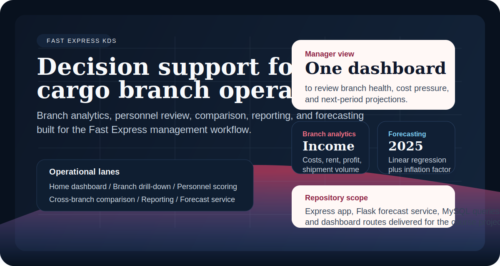
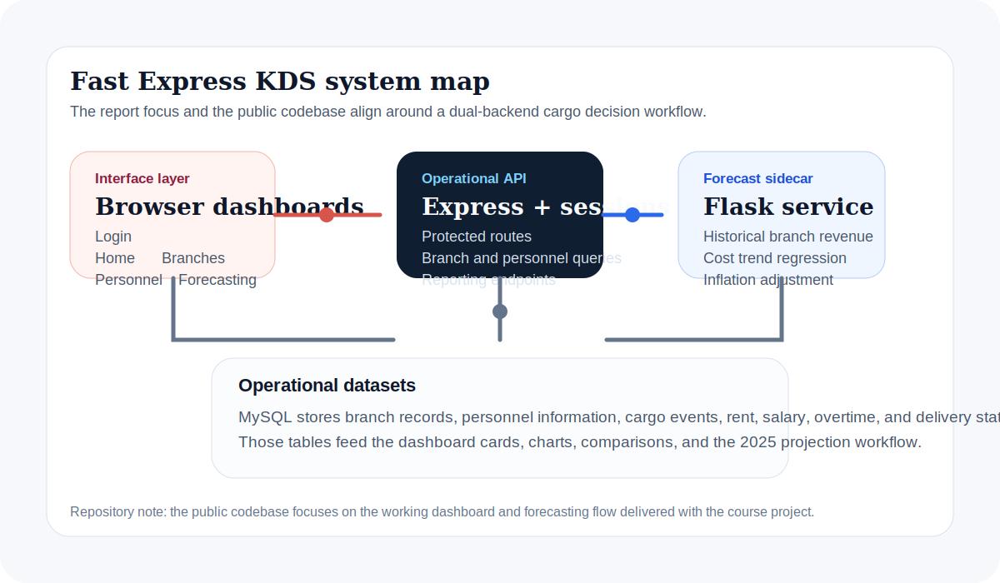

# Fast Express KDS

<p align="center">
  
</p>

<p align="center">
  
  
  
  
  
</p>

Fast Express KDS is a decision support workspace built for middle managers in cargo operations. It combines branch analytics, personnel scoring, cross-branch comparison, reporting, and an inflation-aware forecasting service in one browser-based flow.

The repository reflects the course project described in the accompanying report, but the README is grounded in the current public codebase rather than the report wording alone.

## What the system covers

- Branch-level performance analysis with yearly cargo, income, cost, rent, and profit views
- Personnel analytics with scored performance, delivery ratios, and "employee of the month" summaries
- Cross-branch comparison across selectable periods
- Forecasting service that uses historical branch data and inflation trend projection
- Reporting views for branch-oriented operational review
- Session-based login flow for the main dashboard routes

## Product surfaces

- `public/login.html`: login screen for authenticated access
- `public/index.html`: operational home dashboard with top-line metrics and charts
- `public/subeler.html` and `public/sube_analiz.html`: branch selection and branch drill-down
- `public/personel.html`: personnel scoring, ranking, and comparison
- `public/karsilastirma.html`: map-backed cross-branch comparison flow
- `public/tahminleme.html`: branch selection plus forecast generation
- `public/raporlama.html`: report selection and branch summaries

<p align="center">
  
</p>

## Architecture

- `app.js` runs the main Express application, session management, MySQL queries, dashboard APIs, and protected routes.
- `app.py` exposes the forecasting endpoint and computes branch projections with linear regression and an inflation adjustment.
- `public/` contains the interface layer for login, dashboards, charts, branch analysis, personnel review, comparison, forecasting, and reporting.
- MySQL is the operational data source for branches, personnel, cargo history, and cost calculations.

## Academic context

- Course: `YBS 3015 Karar Destek Sistemleri`
- Project title: `Fast Express Kargo KDS`
- Student: `Batuhan Yüksel`
- Delivery year: `2024`

The original project goal was to support middle-management decisions such as branch performance review, profitability tracking, and branch opening or closure evaluation through data-backed views instead of manual interpretation.

## Tech stack

| Area | Tools |
| --- | --- |
| Web app | Node.js, Express.js, Express Session |
| Forecasting service | Python, Flask, scikit-learn, NumPy |
| Database | MySQL, mysql2 |
| Frontend | HTML, CSS, JavaScript, Chart.js, Leaflet |
| Operations | node-cron, bcrypt, dotenv |

## Repository structure

```text
.
|-- app.js
|-- app.py
|-- data-seeder.js
|-- package.json
|-- public/
|   |-- index.html
|   |-- subeler.html
|   |-- sube_analiz.html
|   |-- personel.html
|   |-- karsilastirma.html
|   |-- tahminleme.html
|   |-- raporlama.html
|   `-- login.html
`-- docs/assets/
```

## Running locally

1. Install the Node.js dependencies:

   ```bash
   npm install
   ```

2. Create an environment file from the provided example:

   ```bash
   cp .env.example .env
   ```

3. Install the Python forecasting service dependencies:

   ```bash
   python3 -m venv .venv
   source .venv/bin/activate
   pip install flask pymysql numpy scikit-learn
   ```

4. Start the Express app:

   ```bash
   npm start
   ```

5. Start the forecasting API in a second terminal:

   ```bash
   source .venv/bin/activate
   python app.py
   ```

The public interface labels are primarily Turkish because the project was originally delivered for a local academic setting.

## Notes on scope

- This repository is strongest as an academic product case study and dashboard implementation.
- The forecasting flow is intentionally lightweight and centered on the course deliverable rather than production-grade model operations.
- The codebase contains both the operational dashboard and the small Python forecasting sidecar because that split is part of the original project structure.

## License

Released under the [MIT License](LICENSE).
